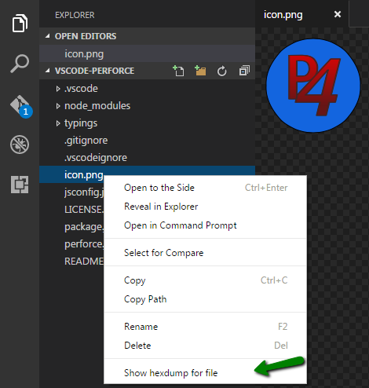
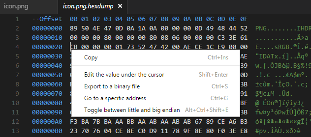

# vscode-hexdump

hexdump for Visual Studio Code

## Description

Display a specified file in hexadecimal

## Main Features

Right-click on a file in the explorer to see *Show hexdump for file*  

Hover in the data section to see numerical values  

Right-click in the hexdump to see more options  

## Commands

* `hexdumpFile` (`ctrl+shift+alt+h`, `cmd+shift+alt+h`) Show hexdump for file
* `editValue` (`shift+enter`) Edit the value under the cursor
* `gotoAddress` (`ctrl+g`) Go to a specific address
* `exportToFile` (`ctrl+s`, `cmd+s`) Export to a binary file

## Configuration

* `hexdump.littleEndian` Set default endianness (true for little endian, false for big endian)
* `hexdump.nibbles` How many nibbles per group (2, 4)
* `hexdump.uppercase` Display hex digits in uppercase
* `hexdump.width` Number of bytes per line (8, 16, 32)
* `hexdump.showOffset` Show offset on first line
* `hexdump.showAddress` Show address on each line
* `hexdump.showAscii` Show ascii section

## Installation

1. Install *Visual Studio Code* (1.7.0 or higher)
2. Launch *Code*
3. From the command palette `Ctrl-Shift-P` (Windows, Linux) or `Cmd-Shift-P` (OSX)
4. Select `Install Extension`
5. Choose the extension `hexdump for VSCode`
6. Reload *Visual Studio Code*

## Contributing

1. Fork it!
2. Create your feature branch: `git checkout -b my-new-feature`
3. Commit your changes: `git commit -am 'Add some feature'`
4. Push to the branch: `git push origin my-new-feature`
5. Submit a pull request :D

## Requirements

Visual Studio Code v1.7.0

## Credits

* [Visual Studio Code](https://code.visualstudio.com/)
* [vscode-docs on GitHub](https://github.com/Microsoft/vscode-docs)
* [hexdump-nodejs on GitHub](https://github.com/bma73/hexdump-nodejs)
* [hexy.js on GitHub](https://github.com/a2800276/hexy.js)

## License

[MIT](LICENSE.md)
